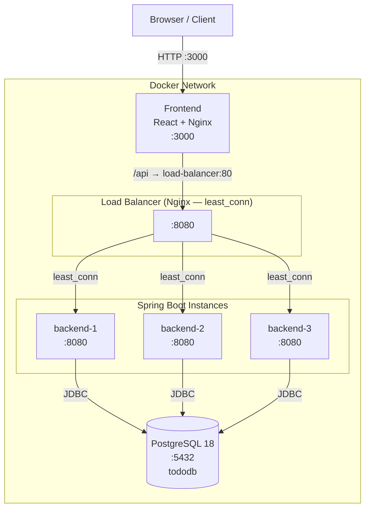
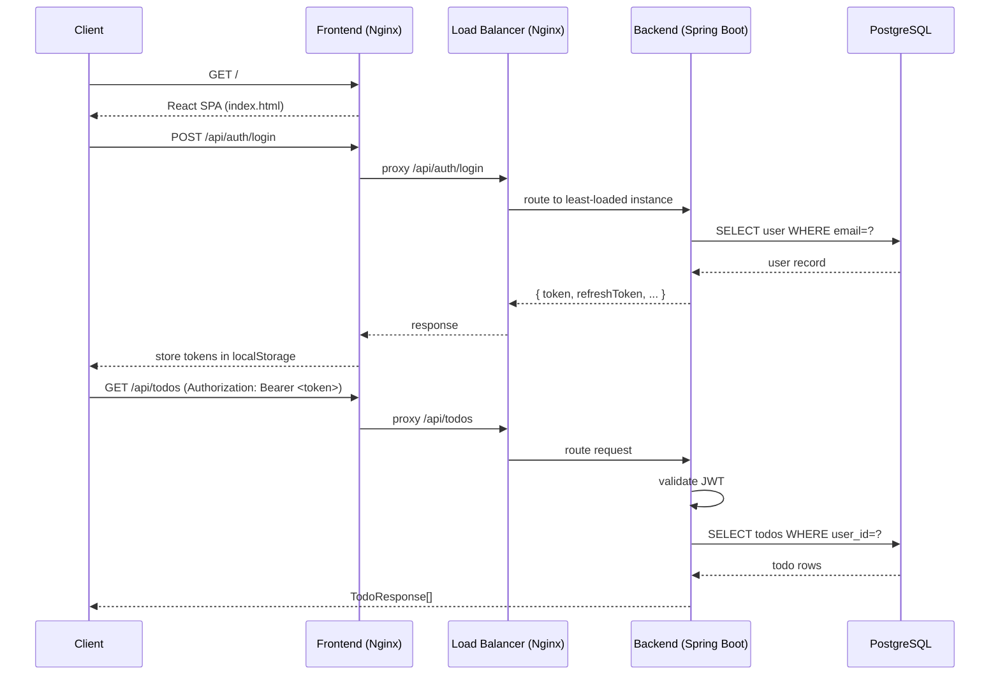
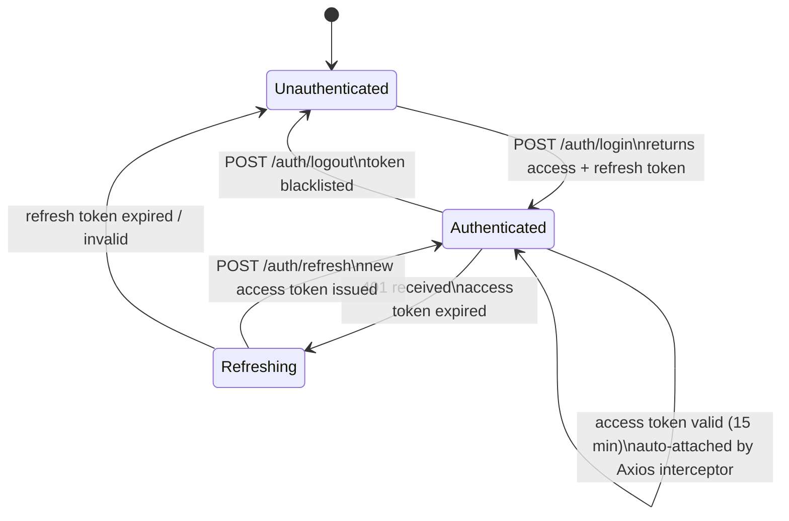

# TodoApp

A distributed, full-stack Todo application with a load-balanced Spring Boot backend, React frontend, PostgreSQL database, and Nginx reverse proxy.

---

## Architecture



### Request Flow



### JWT Token Lifecycle



---

## Tech Stack

### Frontend
| Technology | Version |
|------------|---------|
| React | 19 |
| Vite | 6 |
| Tailwind CSS | 4 |
| Axios | 1.9 |
| React Router | 7 |
| Node.js (build) | 24 |

### Backend
| Technology | Version |
|------------|---------|
| Java | 24 |
| Spring Boot | 3.3.5 |
| Spring Security | 6 |
| JWT (JJWT) | 0.12.3 |
| Flyway | 10 |
| Maven | 3.9 |

### Database
| Technology | Version |
|------------|---------|
| PostgreSQL | 18 |

### Infrastructure
| Technology | Details |
|------------|---------|
| Docker + Docker Compose | Multi-stage builds |
| Nginx (load balancer) | `least_conn`, failover, 3 backends |
| Nginx (frontend) | SPA routing, `/api` proxy |

---

## Project Structure

```
DSy/
├── backend/
│   ├── Dockerfile                          # Multi-stage Java build (JDK 24 → JRE)
│   └── todo-api/
│       ├── pom.xml
│       └── src/main/
│           ├── java/com/todo/
│           │   ├── controller/             # AuthController, TodoController, UserController, HealthController
│           │   ├── service/                # AuthService, TodoService, UserService, TokenBlacklistService
│           │   ├── entity/                 # User, Todo (JPA entities)
│           │   ├── repository/             # UserRepository, TodoRepository (Spring Data JPA)
│           │   ├── security/               # JwtProvider, JwtAuthenticationFilter
│           │   ├── dto/                    # Request/Response DTOs
│           │   └── config/                 # SecurityConfig, DataSeeder
│           └── resources/
│               ├── application.yml
│               └── db/migration/           # Flyway: V1__ schema, V2__ indexes
├── frontend/
│   ├── Dockerfile                          # Node 24 build → Nginx Alpine serve
│   ├── nginx.conf                          # SPA routing + /api proxy
│   ├── vite.config.js
│   ├── index.html
│   └── src/
│       ├── main.jsx
│       ├── App.jsx                         # React Router setup
│       ├── components/                     # Login, Register, Todos, ProtectedRoute
│       ├── context/AuthContext.jsx         # Global auth state (localStorage)
│       └── services/api.js                 # Axios client + auto-refresh interceptor
├── docker-compose.yml
├── nginx-lb.conf                           # Load balancer config
└── README.md
```

---

## API Reference

Base URL: `http://localhost:8080/api`

### Authentication

| Method | Endpoint | Auth | Description |
|--------|----------|------|-------------|
| `POST` | `/auth/register` | No | Create a new account |
| `POST` | `/auth/login` | No | Login, receive access + refresh tokens |
| `POST` | `/auth/refresh` | No | Exchange refresh token for new access token |
| `POST` | `/auth/logout` | Yes | Revoke current access token |

**Login/Register request:**
```json
{ "email": "alice@example.com", "password": "Alice123!" }
```

**Auth response:**
```json
{
  "token": "<jwt-access-token>",
  "refreshToken": "<jwt-refresh-token>",
  "tokenType": "Bearer",
  "expiresIn": 900,
  "username": "alice",
  "email": "alice@example.com"
}
```

### Todos

All endpoints require `Authorization: Bearer <token>`.

| Method | Endpoint | Description |
|--------|----------|-------------|
| `GET` | `/todos` | List all todos for the authenticated user |
| `GET` | `/todos/{id}` | Get a single todo |
| `POST` | `/todos` | Create a todo |
| `PUT` | `/todos/{id}` | Update a todo |
| `PATCH` | `/todos/{id}/toggle` | Toggle completed status |
| `DELETE` | `/todos/{id}` | Delete a todo |

**Todo schema:**
```json
{
  "id": 1,
  "title": "Complete project documentation",
  "description": "Write README and API docs",
  "completed": false,
  "createdAt": "2025-05-11T10:30:00",
  "updatedAt": "2025-05-11T10:30:00"
}
```

### Users

| Method | Endpoint | Description |
|--------|----------|-------------|
| `GET` | `/users/me` | Current user profile |
| `GET` | `/users/{id}` | User by ID |
| `GET` | `/users` | All users |

### Health

| Method | Endpoint | Description |
|--------|----------|-------------|
| `GET` | `/health` | Instance health + name |

---

## Database Schema

```sql
CREATE TABLE users (
    id          BIGINT GENERATED BY DEFAULT AS IDENTITY PRIMARY KEY,
    username    VARCHAR(255) NOT NULL,
    email       VARCHAR(255) NOT NULL UNIQUE,
    password    VARCHAR(255) NOT NULL,
    enabled     BOOLEAN NOT NULL,
    created_at  TIMESTAMP NOT NULL,
    updated_at  TIMESTAMP NOT NULL
);

CREATE TABLE todos (
    id          BIGINT GENERATED BY DEFAULT AS IDENTITY PRIMARY KEY,
    title       VARCHAR(255) NOT NULL,
    description TEXT,
    completed   BOOLEAN NOT NULL,
    user_id     BIGINT NOT NULL REFERENCES users(id),
    created_at  TIMESTAMP,
    updated_at  TIMESTAMP
);

-- Indexes
CREATE INDEX idx_users_email            ON users(email);
CREATE INDEX idx_users_username         ON users(username);
CREATE INDEX idx_todos_user_id          ON todos(user_id);
CREATE INDEX idx_todos_user_completed   ON todos(user_id, completed);
```

Migrations are managed by **Flyway** and run automatically on startup.

---

## Security

- **Algorithm**: HMAC-SHA512 (HS512)
- **Access token TTL**: 15 minutes
- **Refresh token TTL**: 7 days
- **Token claims**: `sub`, `iss`, `aud`, `exp`, `iat`, `jti`, `type`
- **Token revocation**: in-memory blacklist keyed by `jti` (UUID), cleaned up on expiry
- **Auto-refresh**: Axios response interceptor retries on 401 with the refresh token transparently

---

## Getting Started

### Prerequisites

- Docker and Docker Compose

### 1. Clone

```bash
git clone https://github.com/NTVIN/DSy.git
cd DSy
```

### 2. Start

```bash
docker-compose up --build
```

All services start in the correct order. PostgreSQL health-checks gate the backend instances; the load balancer waits for all three backends.

### 3. Access

| Service | URL |
|---------|-----|
| Frontend | http://localhost:3000 |
| API | http://localhost:8080/api |
| Health | http://localhost:8080/api/health |

### 4. Test Accounts

Seeded automatically on first startup:

| Email | Password |
|-------|----------|
| alice@example.com | Alice123! |
| bob@example.com | Bob123! |
| admin@example.com | Admin123! |

### 5. Load Testing

```bash
# Test the API directly through the load balancer
hey -n 1000 -c 50 -H "Authorization: Bearer <token>" http://localhost:8080/api/todos

# Check which backend instance handled a request
curl http://localhost:8080/api/health
```

---

## Load Balancer Configuration

The Nginx load balancer uses `least_conn` routing with automatic failover:

- A backend is marked unavailable after **3 failures within 30 seconds**
- Failed requests are retried on the next available instance (up to 3 attempts)
- Proxy timeouts: 30 seconds connect / send / read
